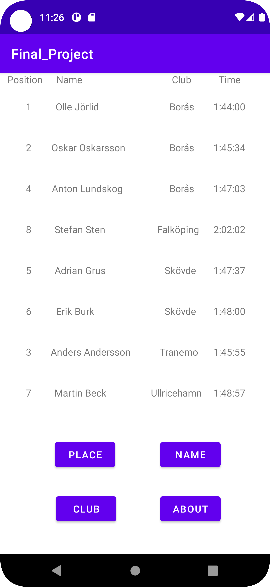
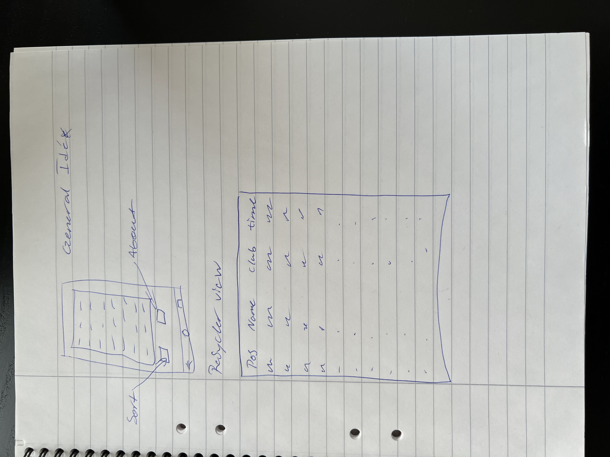

# Rapport

- Projektideen grundar sig i att lista resultatet efter en fikitv skidtävling (en sport jag personligen tränade i flera år).
- Vilket görs genom att hämta resultatet av tävlingen ifrån en Json file detta genom att använda gson.
- Datan som är lagrad i Json filen består av: 
  * Ett ID vilket är varje åkares unika person nummer, vilket därav är ett bra primärnyckel.
  * Skidåkarens namn lagrat i kolumnen Name.
  * Vilken klubb åkaren tävlar för, lagrat i kolumnen Company.
  * Size vilket i applikationen representerar tid.
  * Sista kolumnen i databasen är sedan Cost vilket då representerar placering i tävlingen.
(https://mobprog.webug.se/json-api?login=a21olljo)
- Valet av att använda just pnr som primärnyckel istället för tillexempel placering är i de fall där två personer kommer oavgjort. 
  Därutöver finns utvecklingsmöjligheter i att använda pnr, då det sällan hålls endast en tävling. 
  Utan det är istället mer vanligt att poängen ifrån flera tävlingar läggs samman och bidrar till ett större mästerskap, vilket ett unikt ID så som pnr kan uppfylla.  
  

- Alla dessa värden förutom ID presenteras sedan i en recycler view vilken återfinns i bilderna nedan. 
  Här är även skissen inlagd vilken visar hur appens design och layout kom till.    
- För att lista json datan parsas den fört med hjälp av gson, detta görs genom att hämta datan med klassen JsonTask 
  (https://raw.githubusercontent.com/LenaSYS/mobileapp-programming-networking/master/app/src/main/java/com/example/networking/JsonTask.java) 
- Därefter används klassen ````onPostExecute```` nedan, vilken bryter upp datan efter attributen i Result klassen, och placerar den som object Result i en arraylist kallad result.
- Härefter sorteras arraylist:en efter attributet placering, detta eftersom när datan hämtades ifrån Json scriptet var det sorterat efter pnr.

````
public void onPostExecute(String json) {
Gson gson = new Gson();
    // Unmarshall JSON -> list of objects
    Type type = new TypeToken<ArrayList<Result>>() {}.getType();
    results = gson.fromJson(json, type);
    resultAdapter.setResults(results);
    Collections.sort(results, comparePlace);
    resultAdapter.notifyDataSetChanged();
}
````

- Datan vilken är parsad och sorterad i arrayListen, listas nu i recycler viewn vilken kan ses i bilden nedan, 
  detta utefter layouten visualiserad i skissen (se bilder) och sedan verklighets gjord i activity result_item. 
- Detta genom klassen ResultAdapter vilken genom två funktioner ````onBindViewHolder```` och ````ResultViewHolder````.
  * ````onBindViewHolder```` Binder då attribut av objektet Result (vilken den finner i arraylisten) till views.
  * ````ResultViewHolder```` Specificerar då sedan vilka dessa views är. 

``
public void onBindViewHolder(@NonNull ResultAdapter.ResultViewHolder holder, int position) {
    holder.name.setText(results.get(position).getName());
    holder.club.setText(results.get(position).getCompany());
    holder.position.setText(Integer.toString(results.get(position).getCost()));
    holder.time.setText(results.get(position).getSizeFormatted());
}
public ResultViewHolder(@NonNull View itemView) { 
  super(itemView);
  name = itemView.findViewById(R.id.name);
  club = itemView.findViewById(R.id.club);
  position = itemView.findViewById(R.id.position);
  time = itemView.findViewById(R.id.time);
}
``

- Ett problem vilket uppstod med time attributet en del av Result objektet, var att i kursens webbtjänst där Json datan skulle lagras, 
  kunde inte den ta inmatningen "1:44:00" vilken jag ville ha för time. 
- Så vad jag då gjorde var att jag skrev 14400 i json scriptet och använde sedan koden nedan för att formatera om integern till en array där varje siffra blev ett item. 
  Vilket jag sedan utnyttja för att placera kolon där det skulle vara.

``
public String getSizeFormatted() {
  String time = Integer.toString(size);
  int[] numbers = new int[time.length()];
  for (int i = 0; i < time.length(); i++)
    numbers[i] = time.charAt(i) - '0';
  return numbers[0] + ":" + numbers[1] + numbers[2] + ":" + numbers[3] + numbers[4];
}
``

- Detta kunde nu i efterhand gjorts på mycket smidigare och efektivare sätt, 
  den enklaste lösningen skulle kunna vara att byta datatyp till exempelvis auxdata eller någon vilkan kan ta en string. 
  Den andra och den lösning vilken jag skulle gått med ifall jag gjorde om applicationen, 
  hade varit och ha tiden i sekunder och sedan konvertera det till timmar och minuter.    

- Sortering av data gjordes med hjälp av java utilities collection och funktionen sort vilket jämförde objekten i arraylisten results.
- Därefter combinerades detta med comparator vilket gav koden nedan vilken bestämmer vilket attribute som ska jämföras.  

``
private final Comparator<Result> comparePlace = new Comparator<Result>() {
  @Override
  public int compare(Result r1, Result r2) {
    if(r1.getCost()==r2.getCost())
      return 0;
    else if(r1.getCost() > r2.getCost())
      return 1;
    else
      return -1;
  }
};
``


